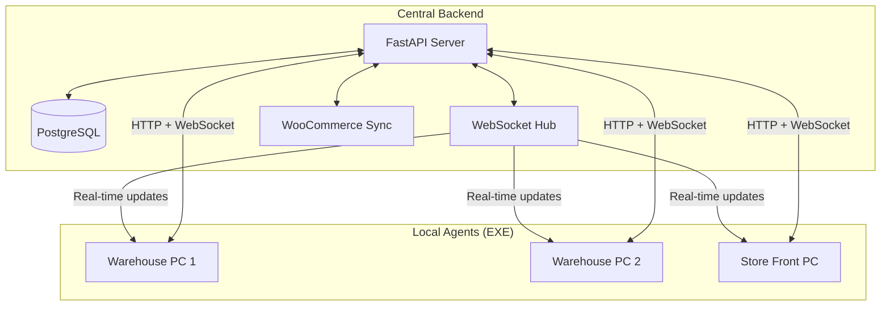
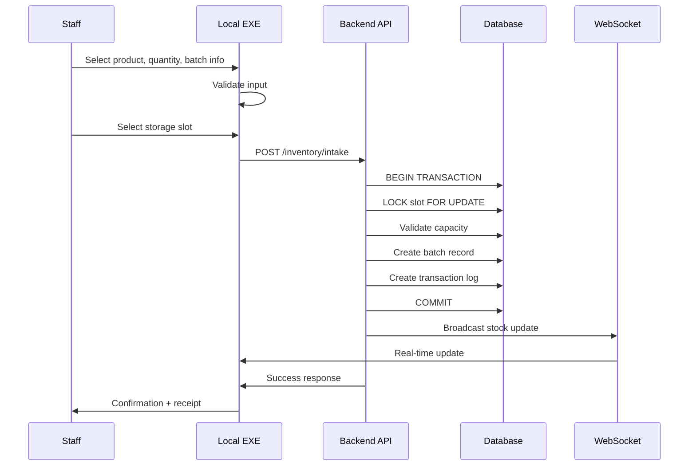
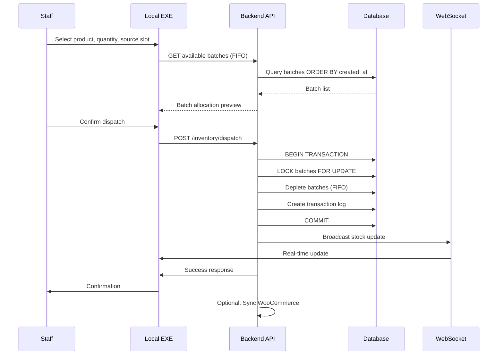
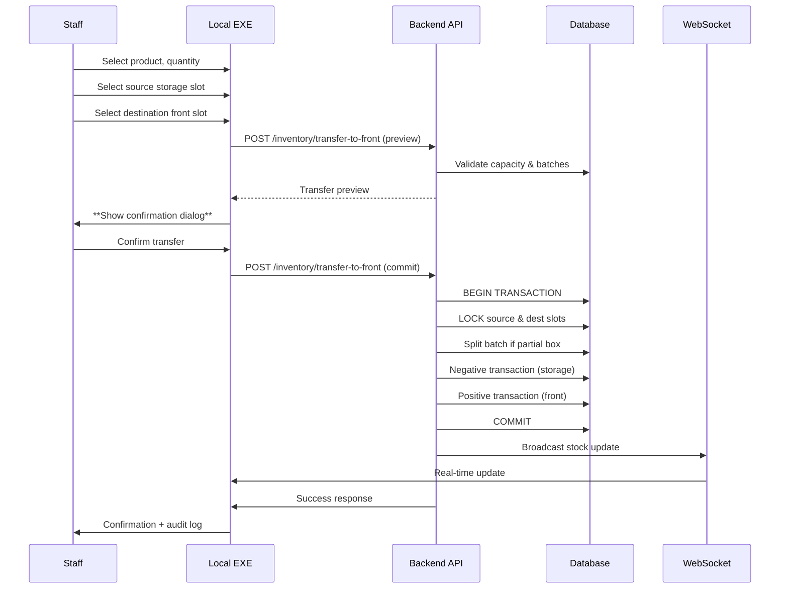
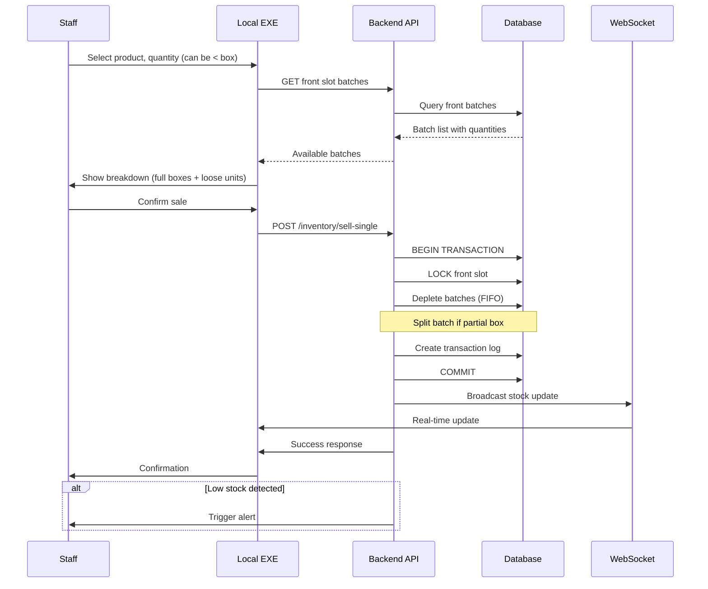
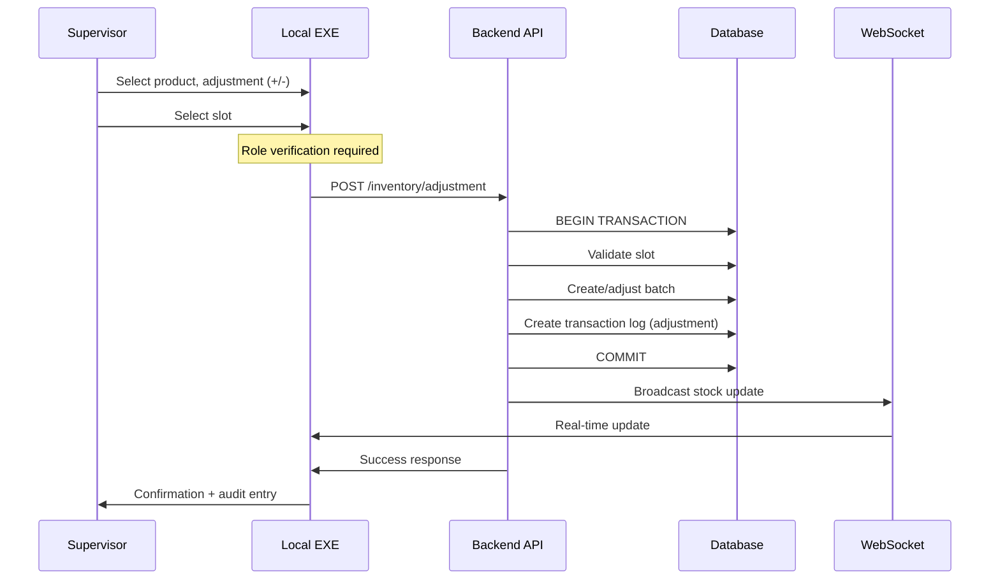
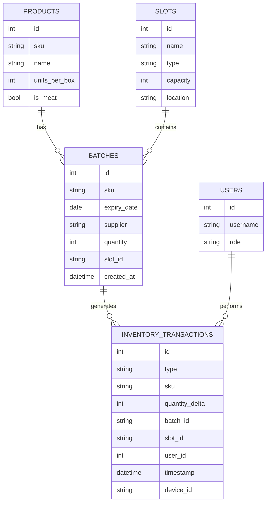

# 🏷 POS-Warehouse Local Agent Specification

## 1. Overview

The **Warehouse Local Agent** is a Windows EXE that connects to a central FastAPI backend (local server or cloud VM) to manage warehouse stock. It supports:

* Intake of stock into storage
* Dispatch for orders/manifests
* Transfer of stock from storage to front (with staff confirmation)
* Partial-item sales from front batches
* Manual adjustments
* Real-time multi-device synchronization

**Target Users:** warehouse staff, store staff, supervisors.

**Key Goals:**

1. Multi-device safe operation
2. Batch-level FIFO tracking
3. Slot capacity enforcement
4. Real-time updates via WebSocket
5. Audit trails for all stock changes

---

## 2. System Architecture



---

## 3. System Requirements

* **Windows 10+**
* Network access to central API server
* Barcode scanner support (optional, recommended)
* SQLite/Drift local cache (optional, for offline logging)
* Notification support for low stock / expiry alerts

---

## 4. Core Data Flows

### 4.1 Intake Flow



---

### 4.2 Dispatch Flow (FIFO)



---

### 4.3 Transfer Storage → Front (With Confirmation)



---

### 4.4 Single-Item Sales from Front (Partial Box Support)



---

### 4.5 Manual Adjustments



---

## 5. UI / Workflow Panels

| Panel | Features |
|-------|----------|
| **Intake** | Select product, quantity, batch info, slot, confirm intake |
| **Dispatch** | Select product, quantity, source slot, confirm removal |
| **Move to Front** | Select product, quantity, source storage, destination front, **staff confirmation** |
| **Front Sales** | Select product, quantity (including partial boxes), confirm sale |
| **Adjustment** | Select product, quantity (+/-), slot, role-based access |
| **Live Stock Overview** | Color-coded slots, capacity & expiry alerts, batch-level quantities |
| **Transaction History** | Audit log for batches, slots, users, devices |

---

## 6. Backend API Endpoints

| Endpoint | Method | Description |
|----------|--------|-------------|
| `/inventory/intake` | POST | Add new stock to storage |
| `/inventory/dispatch` | POST | Remove stock for orders/manifests (FIFO) |
| `/inventory/transfer-to-front` | POST | Move stock storage → front, with confirmation |
| `/inventory/sell-single` | POST | Sell single units from front batches |
| `/inventory/adjustment` | POST | Manual adjustments |
| `/inventory/sku/{sku}` | GET | Live stock summary by SKU |
| `/inventory/slots/{id}` | GET | Slot-level stock breakdown |
| `/inventory/transactions` | GET | Audit log query |
| `/ws` | WebSocket | Real-time stock updates |

---

## 7. Transaction Safety Rules

1. **Use `SERIALIZABLE` transactions** for all stock mutations
2. **Lock all relevant slots** (`FOR UPDATE`)
3. **FIFO logic** for dispatch and front sales
4. **Slot capacity validation** for intake and transfers
5. **Batch splitting** for partial-box moves
6. **Audit all operations** with `inventory_transactions`
7. **Post-commit hooks**: WebSocket broadcast, expiry check, WooCommerce sync

---

## 8. Multi-Device / Real-Time Considerations

* WebSocket pushes SKU updates to all connected EXEs
* Transactions must be **atomic** → no partial writes
* Staff confirmation required for storage → front transfers
* Conflicts handled by backend locks → staff prompted to retry if necessary

---

## 9. UX / Workflow Notes

* Barcode scanner optional but recommended for speed
* Visual indicators for slot capacity and expiry alerts
* Partial-box sales handled via batch splitting
* Role-based access for adjustments / overrides
* Staff confirmation for all front moves to ensure accountability

---

## 10. Database Schema (Key Tables)



---

## 11. API Request/Response Schemas

### 11.1 Intake

**Request:**
```json
POST /inventory/intake
{
  "sku": "PROD-001",
  "quantity": 50,
  "slot_id": "STORAGE-A1",
  "batch_info": {
    "supplier": "Supplier Name",
    "expiry_date": "2026-12-31",
    "is_meat": false
  },
  "user_id": 123,
  "device_id": "warehouse-pc-01"
}
```

**Response:**
```json
{
  "success": true,
  "batch_id": "BATCH-789",
  "transaction_id": "TXN-456",
  "message": "Intake successful. 50 units added to STORAGE-A1"
}
```

---

### 11.2 Dispatch

**Request:**
```json
POST /inventory/dispatch
{
  "sku": "PROD-001",
  "quantity": 25,
  "source_slot_id": "STORAGE-A1",
  "reason": "order-fulfillment",
  "order_id": "ORD-12345",
  "user_id": 123,
  "device_id": "warehouse-pc-01"
}
```

**Response:**
```json
{
  "success": true,
  "batches_depleted": [
    {"batch_id": "BATCH-789", "quantity_taken": 25, "remaining": 25}
  ],
  "transaction_id": "TXN-457",
  "message": "Dispatch successful. 25 units removed from STORAGE-A1"
}
```

---

### 11.3 Transfer to Front

**Request:**
```json
POST /inventory/transfer-to-front
{
  "sku": "PROD-001",
  "quantity": 10,
  "source_slot_id": "STORAGE-A1",
  "dest_slot_id": "FRONT-B2",
  "user_id": 123,
  "device_id": "warehouse-pc-01",
  "confirmed": true
}
```

**Response:**
```json
{
  "success": true,
  "source_transaction_id": "TXN-458",
  "dest_transaction_id": "TXN-459",
  "batch_split": true,
  "new_batch_id": "BATCH-790",
  "message": "Transfer successful. 10 units moved from STORAGE-A1 to FRONT-B2"
}
```

---

### 11.4 Sell Single

**Request:**
```json
POST /inventory/sell-single
{
  "sku": "PROD-001",
  "quantity": 3,
  "front_slot_id": "FRONT-B2",
  "sale_type": "loose_units",
  "user_id": 123,
  "device_id": "store-pc-01"
}
```

**Response:**
```json
{
  "success": true,
  "batches_depleted": [
    {"batch_id": "BATCH-790", "quantity_taken": 3, "remaining": 7}
  ],
  "transaction_id": "TXN-460",
  "message": "Sale successful. 3 units sold from FRONT-B2"
}
```

---

### 11.5 Adjustment

**Request:**
```json
POST /inventory/adjustment
{
  "sku": "PROD-001",
  "quantity_delta": -5,
  "slot_id": "FRONT-B2",
  "reason": "damaged-goods",
  "notes": "5 units damaged during handling",
  "user_id": 123,
  "device_id": "warehouse-pc-01"
}
```

**Response:**
```json
{
  "success": true,
  "transaction_id": "TXN-461",
  "message": "Adjustment successful. -5 units adjusted in FRONT-B2"
}
```

---

## 12. Error Handling

### 12.1 Common Error Responses

**Insufficient Stock:**
```json
{
  "success": false,
  "error": "INSUFFICIENT_STOCK",
  "message": "Only 15 units available in STORAGE-A1, requested 25",
  "available_quantity": 15,
  "requested_quantity": 25
}
```

**Slot Capacity Exceeded:**
```json
{
  "success": false,
  "error": "CAPACITY_EXCEEDED",
  "message": "Slot FRONT-B2 has capacity for 20 more units, attempted to add 30",
  "slot_capacity": 100,
  "slot_current": 80,
  "attempted_add": 30
}
```

**Concurrent Modification:**
```json
{
  "success": false,
  "error": "CONCURRENT_MODIFICATION",
  "message": "Slot STORAGE-A1 was modified by another device. Please retry.",
  "retry_recommended": true
}
```

**Invalid Batch/Expiry:**
```json
{
  "success": false,
  "error": "INVALID_BATCH",
  "message": "Batch expiry date is in the past",
  "expiry_date": "2025-01-01"
}
```

---

## 13. WebSocket Events

### 13.1 Stock Update Event

```json
{
  "event": "stock_update",
  "data": {
    "sku": "PROD-001",
    "total_quantity": 45,
    "slots": [
      {"slot_id": "STORAGE-A1", "quantity": 30},
      {"slot_id": "FRONT-B2", "quantity": 15}
    ],
    "timestamp": "2026-02-27T10:30:00Z"
  }
}
```

### 13.2 Low Stock Alert

```json
{
  "event": "low_stock_alert",
  "data": {
    "sku": "PROD-001",
    "slot_id": "FRONT-B2",
    "current_quantity": 5,
    "threshold": 10,
    "recommended_action": "Transfer from storage"
  }
}
```

### 13.3 Expiry Alert

```json
{
  "event": "expiry_alert",
  "data": {
    "batch_id": "BATCH-789",
    "sku": "PROD-001",
    "expiry_date": "2026-03-05",
    "days_remaining": 7,
    "quantity_remaining": 20
  }
}
```

---

## 14. Suggested Development Steps

1. Implement **FastAPI endpoints** per API spec
2. Implement **Windows EXE panels** per UI flow
3. Integrate **WebSocket** for real-time updates
4. Implement **transaction engine** for intake, dispatch, transfer, sale, adjustment
5. Test **multi-device concurrency** with storage → front moves and partial sales
6. Deploy notifications for low stock / expiry

---

## 15. Appendix: Glossary

| Term | Definition |
|------|------------|
| **Batch** | A specific lot of stock with unique expiry/supplier info |
| **FIFO** | First-In-First-Out stock depletion logic |
| **Front Slot** | Customer-facing shelf location for individual sales |
| **Storage Slot** | Back-of-house location for bulk stock |
| **Transaction** | Atomic record of any stock movement |
| **Slot Capacity** | Maximum units a slot can hold |

---

**Document Version:** 1.0  
**Last Updated:** 2026-02-27  
**Author:** POS Assistant Team
